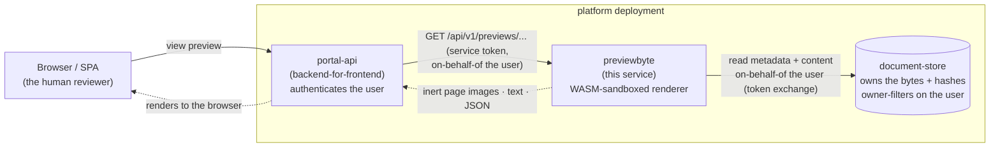
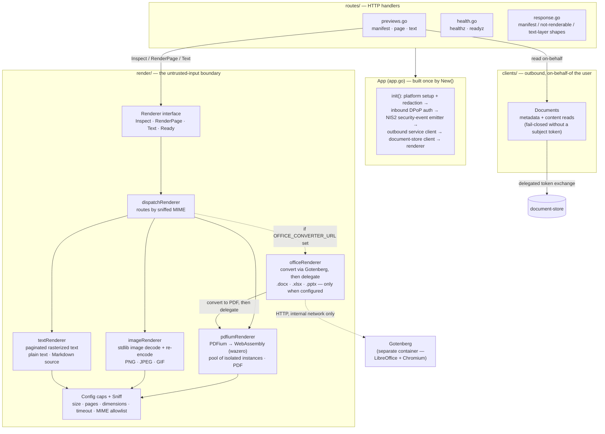
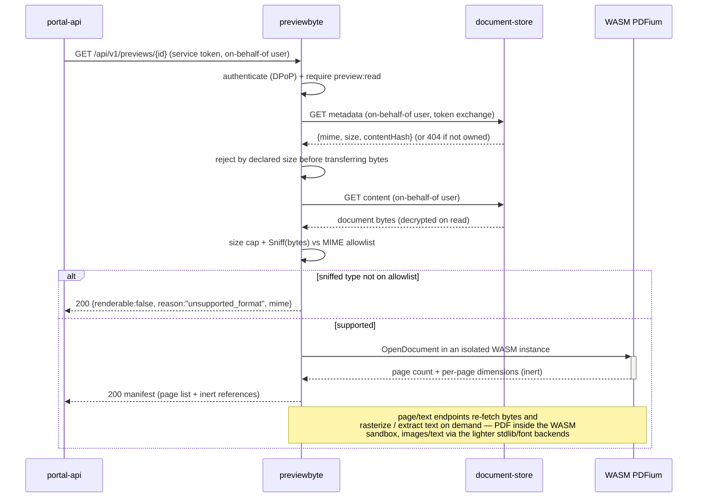

# previewbyte

A reusable, security-hardened **document preview / render** service. Given a document — by reference to a document source — it opens the bytes and returns a **safe, review-only rendering**: inert per-page raster images plus an optional plain-text layer. The output is images, text, and JSON only; no interpretable document and no active content ever reach the caller. A person can read a document before they sign, send, or share it, without any product ever rendering the raw bytes inline.

It is the **one place in the platform that opens untrusted document bytes**, so its whole reason to exist is to do that dangerous, complex job **once, behind hard isolation**. PDF is parsed by PDFium compiled to **WebAssembly** and run inside a pure-Go runtime (an isolated, memory-bounded module with no ambient access to the network or filesystem); the container around it adds a second layer — no egress, a read-only filesystem, dropped capabilities, and resource caps. A parse of malicious input is contained to one job and can reach neither the host nor the rest of the fleet. Common raster images (PNG/JPEG/GIF) and plain text/Markdown are rendered by two lighter backends that carry no comparable parser risk — the Go standard library's own image decoders, and a rasterizer using previewbyte's own vendored font. Office documents (`.docx`/`.xlsx`/`.pptx`) are converted to PDF by an external converter (Gotenberg, wrapping LibreOffice + Chromium) and then rendered through the same PDFium path — that converter is optional (unconfigured means those types simply aren't previewable, not a failure) and runs in its own container, since it is a materially bigger attack surface than anything else this service touches. All four backends are dispatched by the sniffed content type behind the same `Renderer` interface.

It holds **no durable data** — the document source owns the bytes — and **no signing crypto**. It reads the source **on behalf of the user** via delegated-token exchange, so the source's owner-filtering holds end-to-end and the service can never see a document the caller could not. Cross-cutting concerns (logging with redaction, tracing, correlation) are installed once by the shared platform library and are never wired per service.

Its HTTP surface is a small, DPoP-gated, scope-checked read API for a backend-for-frontend, plus two unauthenticated probes. It renders no human UI and persists nothing.

---

## Where it sits

`previewbyte` is one service in a small set, and it never faces the browser directly. The backend-for-frontend (**portal-api**) authenticates the end user and forwards a preview request carrying a service token for this service's audience. `previewbyte` then reads the document bytes from **document-store** — going out **on behalf of the same user** via token exchange — and renders them inside the WebAssembly sandbox. The rendered images and text stream straight back through the caller; nothing is stored.



Division of labour: **portal-api** owns the human session, the user-facing audit of "who viewed what" (it is the tier that knows the actor is a person), and delivery to the browser. **document-store** owns the durable bytes and the owner-filtering. `previewbyte` owns exactly one thing — turning bytes into an inert, review-only rendering behind isolation — and owns no state of its own. The two meet at a delegated (on-behalf-of) token: `previewbyte` reads document-store with the *user's* authority, never its own, so it can only ever render a document the user could already read.

---

## HTTP surface

The `/api/v1` surface is DPoP-authenticated and requires the `preview:read` scope (modelled as a `group:level` pair). Every document read underneath it goes out on behalf of the user. Application errors use the shared RFC 9457 problem envelope; the two probes return a plain `{status}` body so an orchestrator gets a uniform signal.

| Method + path | Purpose | Notes |
|---|---|---|
| `GET /api/v1/previews/{documentId}` | Preview manifest — page list, per-page pixel dimensions, and the inert references to fetch | Returns a typed `{renderable:false, reason, mime}` result (200) for a non-previewable type, so the caller can offer "download to review" — never an error to guess at |
| `GET /api/v1/previews/{documentId}/pages/{n}` | One rendered, inert page image | Zero-based page index; `image/png` with `Cache-Control: no-store`; `404` for a page past the end, `415` for an unsupported document |
| `GET /api/v1/previews/{documentId}/text` | The optional plain-text layer (one entry per page) | `404` when the document has no extractable text |
| `GET /healthz` | Liveness | `200` whenever the process is up; skips the access log |
| `GET /readyz` | Readiness | `503` when the render-engine pool cannot hand out a live instance, else `200` |

A read that hits an unconfigured document source fails closed with `503` (`err:preview:notConfigured`). A source not-found — which is also how document-store reports a document the user does *not* own — maps to this service's own `404`, never another user's content. Any other upstream error is **relayed** (its terminal code, source, and trace id preserved and this hop appended) rather than collapsed to a bare gateway error; a server-side upstream failure maps to `502`, and a transport failure with no HTTP response at all becomes a uniform `err:upstream:unavailable` (`502`). An unreachable **Office converter** is its own distinguishable `502` (`err:preview:upstreamUnavailable`) — "try again," not the `200 renderable:false` a genuinely unsupported type gets, and not a bare `500`.

---

## Architecture

One application object (`App` in [`app.go`](app.go)) wires every dependency at startup and **fails closed** on misconfiguration — a bad auth issuer, an invalid render cap, or an unusable WebAssembly pool stops the process from starting. The renderer is an interface (`render.Renderer`); a small dispatcher picks the concrete backend by sniffed content type, so the untrusted-input boundary stays a single, swappable seam per format.



A request flows: authenticate + scope-check → read bytes from document-store on behalf of the user → size-cap and content-type **sniff** (the declared MIME is never trusted) → render inside the sandbox → return inert output.



---

## The sandbox / untrusted-input boundary

Opening arbitrary document bytes is the single most dangerous operation in the platform, so it is isolated twice over.

- **Inner sandbox — WebAssembly (PDF).** The PDF engine is [PDFium](https://pdfium.googlesource.com/pdfium/) compiled to **WebAssembly** and executed inside a pure-Go [wazero](https://wazero.io/) runtime. The binary is embedded in the render library and pinned by checksum, so there is no external blob and no runtime download. The parser runs in an isolated linear-memory module with **no ambient access to the network or filesystem** — a parser fault, a malformed object graph, or an exploit attempt is contained to one job and cannot reach the host process. CGO is disabled, so the shipped binary is fully static with no system-library attack surface.
- **Images and plain text/Markdown carry a different, smaller trust profile.** Raster images are decoded with the Go standard library's own `image` package (already inside the platform's trust boundary — the same runtime decodes every HTTP body and JSON payload it handles) and always **re-encoded** before they leave the service, so the caller never receives the original byte stream. Plain text/Markdown is never parsed as a document at all — its bytes are word-wrapped and rasterized with previewbyte's own vendored font, never interpreted as Markdown syntax or any other markup. Neither backend opens a document format complex enough to warrant its own WASM sandbox; both still go through every cap below.
- **Outer sandbox — the container.** The service opens untrusted content, so the container is run locked down (enforced by the orchestrator, not the image): **no network egress**, a **read-only root filesystem** with a small tmpfs scratch mount, **no added capabilities** and no privilege escalation, running as a non-root user on a minimal rootless scratch base, with memory and CPU limits. This is defence-in-depth around every backend — a least-privilege posture on top of already-bounded parsers.
- **Bounded render.** Every parse is capped before and during execution: an input **size cap** rejects oversized bytes before any parse; a content-type **sniff + allowlist** ignores the declared MIME entirely (the bytes decide the type); a **page-count cap** and **output-dimension cap** (max DPI clamped so a rendered page never exceeds the max width) stop render-bombs; a **declared-pixel-count cap** rejects an oversized image claim before any pixel buffer is allocated; and a **render timeout** kills a runaway job. A pool of WASM instances bounds PDF concurrency.
- **Inert output only.** Every backend emits raster images (PNG), extracted plain text, and structured metadata — never an interpretable document and never any active content (no scripts, no embedded actions, no forms, no Markdown rendered as markup). A document the engine cannot open, or a type off the allowlist, becomes a **typed not-renderable result** (`unsupported_format` / `too_large` / `too_many_pages`), not a raw engine or stack message — the internal error text never crosses the boundary to the caller.

---

## State and data model

**The service holds no durable data and no signing keys.** There is no database, no object storage, and no cache: document bytes are streamed from document-store on behalf of the user, rendered in memory, and returned. The bytes are sensitive (document-store decrypts them on read) and are never persisted or logged. Redaction is installed by the platform library before any handler can log a field.

Because the durable authority is document-store, owner-filtering holds end-to-end: `previewbyte` acts only with the user's delegated authority, so it can render exactly the documents that user could fetch directly — no more. It authors no audit event itself; the audit of a human viewing a preview is emitted by portal-api, the tier that knows the actor is a person (GDPR data minimisation — this background renderer records nothing about who viewed what).

---

## Configuration

Standard fleet env (`SERVER_URLS`, `SERVICE_NAME`, `ENVIRONMENT`, `LOG_*`, `METRICS_ENABLED`, `OTEL_*`) comes from the shared base configuration, plus:

| Env var | Default | Meaning |
|---|---|---|
| `AUTH_ISSUER_URL` | — (required) | Inbound token issuer for DPoP validation |
| `SERVICE_AUDIENCE` | `svc:preview` | This service's own audience — the value an inbound service token must target |
| `SERVICE_CLIENT_ID` | `svc:preview` | Service identity used for the outbound on-behalf-of token exchange |
| `SERVICE_CLIENT_SECRET` | — | Client secret for that identity. Secret: also resolved via the `SERVICE_CLIENT_SECRET_FILE` convention (a secret-store / Vault-agent file); an explicit env value still overrides it |
| `OUTBOUND_ISSUER_URL` | — (⇒ `AUTH_ISSUER_URL`) | In-network address the outbound token mint is called at (the issuer claim stays the inbound issuer) |
| `DOCUMENT_BASE_URL` | — (empty ⇒ by-reference preview fails closed) | Base URL of the document source (document-store) |
| `DOCUMENT_AUDIENCE` | `svc:document` | Target audience for the delegated token used to read the source |
| `RENDER_MODE` | `raster` | Output strategy (raster only in this build) |
| `RENDER_MAX_DPI` | `150` | Maximum render DPI (≤ 600) |
| `RENDER_MAX_WIDTH` | `2048` | Maximum rendered page width in px (≤ 8192); DPI is clamped down so no page exceeds it |
| `RENDER_IMAGE_FORMAT` | `png` | Output image format (PNG only in this build) |
| `RENDER_TIMEOUT` | `20s` | Per-render time ceiling — kills a runaway job |
| `RENDER_MAX_PAGES` | `100` | Page-count cap — a document above it is not-renderable |
| `RENDER_POOL_SIZE` | `2` | Number of WebAssembly engine instances (bounds concurrency) |
| `INPUT_MAX_BYTES` | `64 MiB` | Input size cap — larger inputs are rejected before any parse |
| `SUPPORTED_MIME` | `application/pdf,image/png,image/jpeg,image/gif,text/plain` | Content-type allowlist, comma-separated; matched against the **sniffed** type, never the declared one. A `.md` upload sniffs as `text/plain` (there is no distinct signature for Markdown) and is rendered as plain text, never as rendered Markdown. Office MIME types are added automatically when `OFFICE_CONVERTER_URL` is set (below) — this list never needs editing to turn that on |
| `OFFICE_CONVERTER_URL` | *(empty)* | Base URL of an Office-document converter (Gotenberg). **Empty = Office preview is off** — `.docx`/`.xlsx`/`.pptx` get the same `renderable:false` as any other unsupported type, not a failure; no separate feature flag |
| `OFFICE_CONVERTER_TIMEOUT` | `30s` | The whole conversion round trip (LibreOffice startup + layout + export is seconds, not the milliseconds a WASM page render takes — a separate knob from `RENDER_TIMEOUT`) |
| `DEV_ACCEPT_USER_TOKEN` | `false` | **Development only** — accept the demo SPA's public-client user token and relax per-endpoint scope checks. Never enable in production |
| `DEV_USER_TOKEN_AUDIENCE` | `portal-api` | Audience accepted when the dev concession above is on |

---

## Directory layout

```
previewbyte/
├── app.go, config.go, testing.go   — App container, configuration + render caps, test harness (TestApp)
├── cmd/server/                     — CLI entrypoint
│   ├── main.go                     — cobra root; default SERVER_URLS
│   ├── web.go                      — `web` subcommand: build App + register routes + serve
│   └── health.go                   — `health` subcommand: container HEALTHCHECK probe
├── routes/                         — HTTP handlers
│   ├── router.go                   — route registration + preview:read scope gate + its authz.denied security event
│   ├── router_test.go              — proves the security event fires on denial, and only on denial
│   ├── previews.go                 — manifest · page image · text; on-behalf read; error mapping
│   ├── response.go                 — Manifest / PageRef / NotRenderable / TextLayer shapes
│   └── health.go                   — healthz · readyz
├── clients/                        — outbound, on-behalf-of the user
│   ├── clients.go                  — shared on-behalf request (token exchange, fail-closed, HTTPError)
│   └── document.go                 — document-store client (metadata + content)
├── render/                         — the untrusted-input boundary
│   ├── render.go                   — Renderer interface, Config caps, Sniff, typed outcomes
│   ├── dispatch.go                 — routes each call to a backend by sniffed MIME
│   ├── pdfium.go                   — PDFium-on-WebAssembly (wazero) implementation + instance pool (PDF)
│   ├── image.go                    — stdlib decode/re-encode + dimension caps (PNG/JPEG/GIF)
│   ├── text.go                     — paginated rasterized text (plain text/Markdown source)
│   ├── office.go                   — Office documents: convert via Gotenberg, delegate to PDFium
│   ├── render_test.go              — integration test against the real WASM engine
│   ├── sniff_test.go                — the OOXML zip-marker disambiguation
│   ├── fuzz_test.go                 — the P3 malicious-PDF/bomb abuse corpus (one Fuzz* target per backend)
│   ├── dispatch_test.go, image_test.go, text_test.go, office_test.go — the other backends' unit tests
└── Dockerfile                      — static (CGO-off) build → rootless scratch (nonroot); hardening note
```

---

## Development

The module is a standard Go build with no CGO and no external services in the test path. Because the PDF engine is embedded WebAssembly, the render integration test drives the **real** engine in-process — no Docker, no network, no fixture download. The image and text backends have no engine to warm up at all: their tests build sample images/text in code and assert against the real standard-library decoders and the real vendored font.

```bash
# Build the static server binary (matches the Dockerfile).
CGO_ENABLED=0 go build -trimpath -ldflags="-s -w" -o server ./cmd/server

go vet ./...
go test ./...        # includes render/render_test.go — a real PDF through the real WASM PDFium engine

# Exercise just the engine end-to-end (inspect → render PNG → extract text):
go test ./render/ -run TestPDFium -v

# Run locally.
DOCUMENT_BASE_URL=http://localhost:19000 AUTH_ISSUER_URL=http://localhost:8080 ./server web
```

`render_test.go` builds a valid single-page PDF in code and asserts it inspects to one page, rasterizes to a decodable PNG, and yields its text layer — plus the negative paths (non-PDF → `unsupported_format`, out-of-range page → `page_out_of_range`, page cap → `too_many_pages`). The handler tests in `routes/` run against a stubbed on-behalf transport and a fake renderer, so they cover the auth/scope/on-behalf/error-mapping logic without a real engine or source. `testing.go` exposes `TestApp` for both.

---

## Security invariants

- **Untrusted bytes are only ever opened by a bounded backend.** PDF is parsed by PDFium-on-WebAssembly in a wazero runtime — isolated linear memory, no ambient network or filesystem — and CGO is off, so the binary is static; a parser fault is contained to one job. Raster images go through the Go standard library's own decoders and are always re-encoded before leaving the service. Plain text/Markdown is never parsed as a document — only word-wrapped and rasterized with previewbyte's own font. Office documents are the exception to "opened here": the actual parsing happens in a **separate container** (Gotenberg, a real office suite + browser engine — a materially bigger surface than anything else this service touches), reached over the network and optional by design; the PDF it returns is re-sniffed (never trusted by declared type) before it goes through the same PDFium path as any other PDF.
- **Defence in depth at the container.** Run with no egress, a read-only root filesystem + tmpfs scratch, dropped capabilities, no privilege escalation, non-root on a minimal scratch base, and memory/CPU limits (least-privilege posture).
- **Inert output only.** Images, text, and JSON — never an interpretable document, never active content. Internal engine/stack error text never crosses to the caller; a non-renderable input is a *typed* result, not a leaked message.
- **The declared type is never trusted.** Content is sniffed from the bytes and matched against an allowlist; anything off it is not-renderable.
- **Every render is bounded.** Input-size cap (before any parse), page-count cap, output-dimension cap, and a render timeout — no unbounded parse.
- **On-behalf-of, fail-closed.** Document reads use the user's delegated authority via token exchange, never the service's own identity; a call without a subject token fails closed rather than falling back. Owner-filtering holds end-to-end — the service cannot see a document the caller could not.
- **No durable data, no keys.** Nothing is persisted or cached; document bytes live only transiently in memory and are never logged. There are no signing keys.
- **NIS2 security events on its own boundary.** A scope denial (an authenticated caller without `preview:read`) emits an `authz.denied` event via [`go-sec-events`](https://github.com/gmb-lib/go-sec-events) — the same platform-standard control every other backend service in the fleet carries, using its `LogSink` (structured log line → the existing Loki/alloy pipeline → SIEM; no broker, no new infrastructure). Scoped deliberately to previewbyte's own inbound boundary — the one signal only this service can see with full fidelity, unlike a caller that only ever observes the resulting `403`.
- **Fuzzed in CI.** Every backend that opens untrusted bytes (`render/fuzz_test.go`) has a fuzz target — malicious/malformed PDF, declared-dimension image bombs, adversarial OOXML zip markers, non-UTF-8 text — run 30s per target on every push (`fuzz-short` in `.github/workflows/ci.yml`). The Office backend's outbound request target is proven invariant to document content (`TestOfficeRequestTargetIgnoresDocumentContent`) — no document payload can redirect the Gotenberg call.

---

## Known limitations

- **PDF, common raster images (PNG/JPEG/GIF), plain text/Markdown, and — when `OFFICE_CONVERTER_URL` is configured — .docx/.xlsx/.pptx.** [PDF (ISO 32000)](https://www.iso.org/standard/75839.html) renders to PNG page images plus a text layer; images are decoded and re-encoded to a single PNG page; plain text/Markdown is paginated and rasterized to PNG pages, source verbatim (Markdown is never rendered as markup); Office documents convert to PDF via Gotenberg, then render through the same PDF path. Any other type — or an Office type with no converter configured — returns a typed not-renderable result. **LibreOffice's own format auto-detection is permissive**, not strict: a corrupted or mislabeled Office upload is more likely to convert into *something* (possibly low-fidelity) than to fail cleanly — still always inert, just not always a clean "unsupported" answer. WebP output, ODF formats, a sanitized-PDF mode, and a direct-bytes (by-value) mode are later additions; today the only input path is by reference to the document source.
- **No cache.** Every request re-fetches the source bytes and re-renders. The manifest's `expiresAt` is a presentation hint only until an (ephemeral, encrypted) cache is added; there is no persistence layer.
- **Single document source.** One `DOCUMENT_BASE_URL` is wired; multiple sources are not yet supported. With no source configured, the by-reference preview fails closed (`503`).
- **Text extraction is best-effort.** The plain-text layer is whatever the engine can extract; a scanned/image-only PDF has no extractable text and the text endpoint returns `404` (no OCR).
